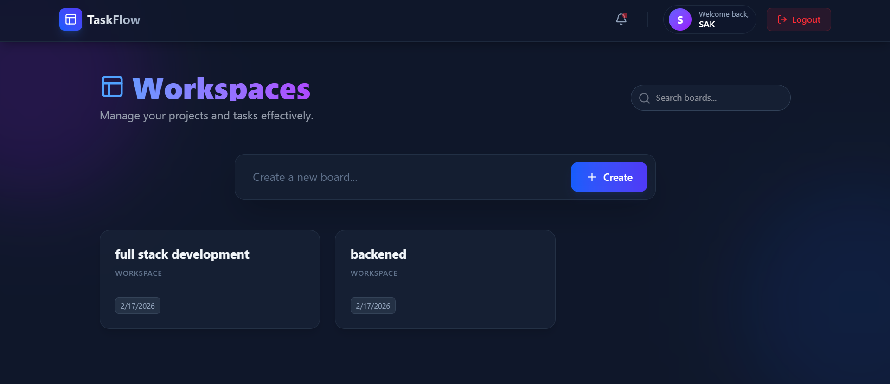

# TaskFlow - Real-Time Collaboration Platform

A full-stack task management application similar to Trello, featuring real-time updates, drag-and-drop task management, and activity tracking.



## 🚀 Features
- **Authentication:** JWT-based Signup/Login.
- **Real-Time Collaboration:** Instant updates across users using Socket.io.
- **Task Management:** Create boards, lists, and tasks.
- **Drag & Drop:** Smooth drag-and-drop interface powered by `@hello-pangea/dnd`.
- **Activity Logging:** Tracks user actions (Task Created, Moved, Deleted).

## 🛠️ Tech Stack
- **Frontend:** React, Tailwind CSS, Framer Motion, Socket.io Client.
- **Backend:** Node.js, Express.js, Socket.io.
- **Database:** MongoDB (Atlas).

## ⚙️ Setup Instructions
1. **Clone the repository:**
   ```bash
   git clone [https://github.com/Sarthakkeche/task-collab-platform.git]
   cd task-collab-platform


## Backend Setup (Server)
Open a terminal and run:

Bash
cd server
npm install

## Create a .env file in the server folder with the following credentials:

PORT=5000
MONGO_URI=your_mongodb_connection_string_here
JWT_SECRET=your_secret_key_here

## Start the Backend Server:

Bash
node server.js

## Frontend Setup (Client)
## Open a new terminal window (keep the server running) and run:

Bash
cd client
npm install


## Start the React App:

Bash
npm run dev
# The app will launch at http://localhost:5173